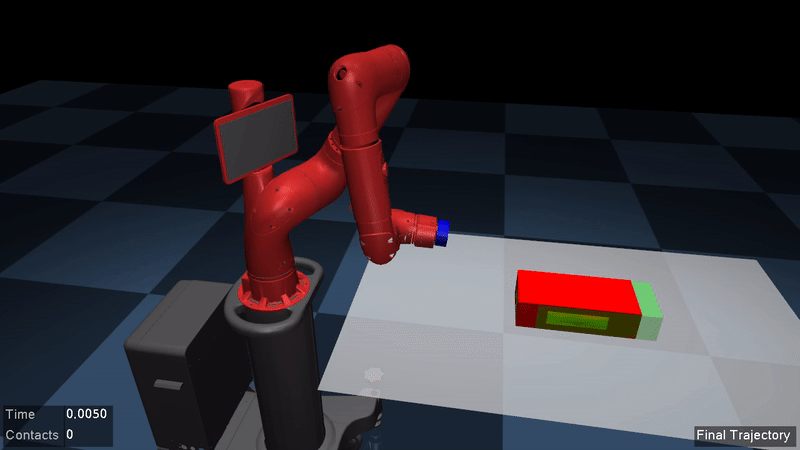
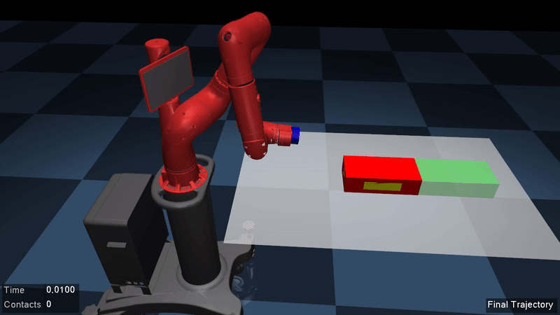
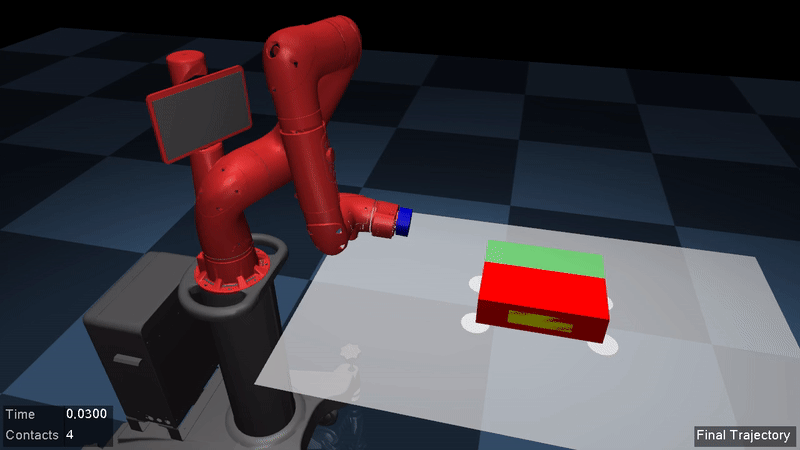
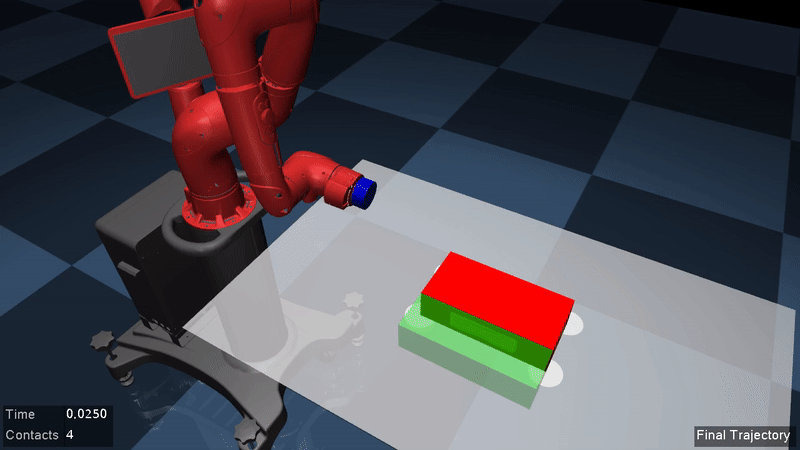
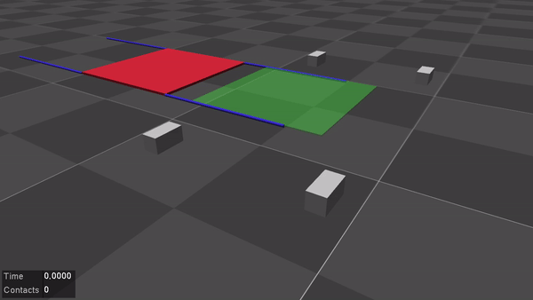
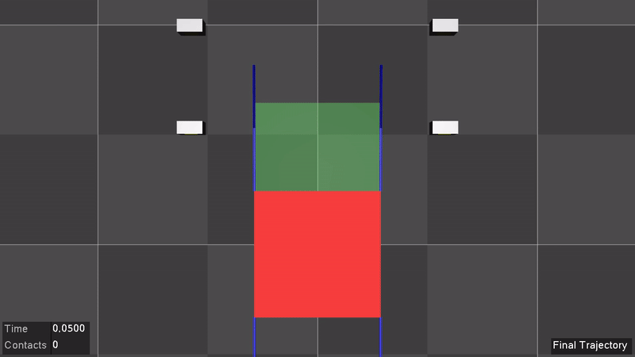
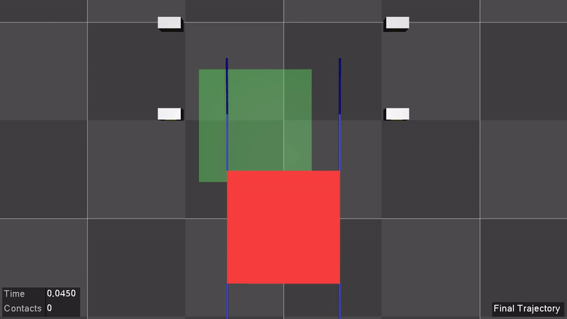

# Contact-Implicit Trajectory Optimization (CITO)

This package provides a contact-implicit trajectory optimization (CITO) framework for planning non-prehensile manipulation and locomotion trajectories without a predefined contact schedule. The planning algorithm  is based on a variable smooth contact model and successive convexification. Please see the [references](##Citing) for a detailed description of the algorithm.

In this framework, MuJoCo is used to evaluate the nonlinear dynamics. The partial derivatives
of the dynamics about the previous trajectory are obtained by numerical differentiation.
The resulting convex subproblems are solved by SQOPT to exploit the sparsity.

The code is implemented using C++11 in a catkin build environment.

_Please note that both the method and the code are currently under development._

## Dependencies
- [ROS (catkin)](http://wiki.ros.org/catkin)
- [Eigen 3](https://eigen.tuxfamily.org/dox/GettingStarted.html)
- [MuJoCo 2.00](http://www.mujoco.org/)
- [SNOPT 7](https://ccom.ucsd.edu/~optimizers/solvers/snopt/)
- [FCL](https://github.com/flexible-collision-library/fcl)
- [YAML](https://github.com/jbeder/yaml-cpp)

## Installation
1. Create a workspace and clone this repo:
    ```
    mkdir -p ~/cito_ws/src
    cd ~/cito_ws/src/
    git clone https://github.com/aykutonol/cito.git
    ```  
2. Set the following environment variables:
    ```
    export CITO_WS=~/cito_ws  
    export MJ_KEY=*path to the licence file for MuJoCo*
    export MJ_HOME=*path to the home directory of MuJoCo*  
    export SN_HOME=*path to the home directory of SNOPT*  
    ```
3. Build the package:
    ```
    cd ~/cito_ws/
    catkin build
    source devel/setup.bash
    ```

#### On Mac OSX
Change the install names for MuJoCo libraries to absolute paths:
```
install_name_tool -id "$MJ_HOME/bin/libmujoco200nogl.dylib" $MJ_HOME/bin/libmujoco200nogl.dylib
install_name_tool -id "$MJ_HOME/bin/libmujoco200.dylib" $MJ_HOME/bin/libmujoco200.dylib
install_name_tool -id "$MJ_HOME/bin/libglfw.3.dylib" $MJ_HOME/bin/libglfw.3.dylib
```


## Usage
The parameters related to the model (i.e., model file and contact pairs), the task (i.e., desired final
pose and velocity), and the simulation (i.e., time horizon length and control sampling period) are defined in `config/params.yaml`.

The contact pairs are defined in terms of sites that are defined in the model file. A site can be defined
in the model file such that it is positioned at the center of the contact surface and its +x axis is aligned with the direction of the virtual force that will be generated on the control joint (e.g., an object or the torso of an under-actuated robot).

A motion can be planned by running the main:  
`rosrun cito main`  
which will record the optimal trajectory into `cito_ws/logs/mjLog_model_name` (a binary file) for rendering as well as the joint position, velocity, acceleration, and force trajectories into `cito_ws/logs/traj_model_name ` (a readable file) so that they can be sent to the robot.

The planned motion can be played back by:  
`rosrun cito playlog`

The successive convexification parameters and the variable smooth contact model parameters can be changed through `config/scvx.yaml` and `config/vscm.yaml`.


## Examples
**Tabletop pushing with a 7-DOF arm**
In this application, the task is to push a box on a table with a 7-DOF robot arm, Sawyer. The model file 
is `model/sawyer_push.xml`. For this example, `config/params_sawyer.yaml` needs to be copied and pasted into `config/params.yaml`. Example motions for pushing the box 5 and 30 cm forward, 10 cm left, and 10 cm right are shown below.

<p align="middle">
  
  
  
  
</p>

**Pushing with a mobile robot**
Using the same framework, it is possible to generate pushing motions for various pusher-slider systems. As an example, we consider Human Support Robot (HSR) by Toyota pushing a box on the floor using its velocity controlled, holonomic base, as demonstrated in the following. Here, the friction coefficient is 1 for the first result and 0.1 for the second.

<p align="middle">
  
  
</p>


**Simple humanoid locomotion in zero gravity (_Flymanoid_)**  
The goal in this application is to plan a locomotion behavior for a planar human-like robot in zero gravity. 
The model file is `model/flymanoid.xml`. This example can be used by replacing `config/params.yaml` by 
`config/params_flymanoid.yaml`. Example motions for moving the torso to desired positions are shown below.

<p align="middle">
  
  
  
</p>


## Citing
If you use this package, please consider citing the following papers:

[1] [Önol, A. Ö., Corcodel, R., Long, P., & Padır, T. (2020, May). Tuning-Free Contact-Implicit Trajectory Optimization.
In _2020 IEEE International Conference on Robotics and Automation (ICRA)_. IEEE.](https://arxiv.org/abs/2006.06176)
```
@inproceedings{onol2020tuning,
  title={Tuning-Free Contact-Implicit Trajectory Optimization},
  author={{\"{O}}nol, Aykut {\"{O}}zg{\"{u}}n and R. {Corcodel} and P. {Long} and Pad{\i}r, Ta{\c{s}}k{\i}n}},
  booktitle={2020 IEEE International Conference on Robotics and Automation (ICRA)},
  year={2020},
  doi={10.1109/ICRA40945.2020.9196805},
  organization={IEEE}}
```
[2] [Önol, A. Ö., Long, P., & Padır, T. (2019, May). Contact-Implicit Trajectory Optimization
Based on a Variable Smooth Contact Model and Successive Convexification.
In _2019 IEEE International Conference on Robotics and Automation (ICRA)_. IEEE.](https://arxiv.org/abs/1810.10462)
```
@inproceedings{onol2019contact,
  title={Contact-Implicit Trajectory Optimization Based on a Variable Smooth Contact Model and Successive Convexification},
  author={{\"{O}}nol, Aykut {\"{O}}zg{\"{u}}n and Long, Philip and Pad{\i}r, Ta{\c{s}}k{\i}n},
  booktitle={2019 IEEE International Conference on Robotics and Automation (ICRA)},
  year={2019},
  doi={10.1109/ICRA.2019.8794250},
  organization={IEEE}}
```
[3] [Önol, A. Ö., Long, P., & Padır, T. (2018, Oct.). A Comparative Analysis of Contact Models in Trajectory Optimization for Manipulation.
In _2018 IEEE/RSJ International Conference on Intelligent Robots and Systems (IROS)_. IEEE.](https://arxiv.org/abs/1806.01425)

```
@inproceedings{onol2018comparative,
  title={A Comparative Analysis of Contact Models in Trajectory Optimization for Manipulation},
  author={{\"{O}}nol, Aykut {\"{O}}zg{\"{u}}n and Long, Philip and Pad{\i}r, Ta{\c{s}}k{\i}n},
  booktitle={2018 IEEE/RSJ International Conference on Intelligent Robots and Systems (IROS)},
  year={2018},
  doi={10.1109/IROS.2018.8594284},
  organization={IEEE}}
```
