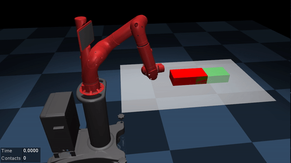

# Contact-Implicit Trajectory Optimization (CITO)

This package is developed for planning non-prehensile manipulation and locomotion
motions without a predefined contact schedule. The planning algorithm 
is based on a variable smooth contact model and successive convexification. 
Please see [1] for a detailed description of the algorithm.

In this framework, MuJoCo is used to evaluate the nonlinear dynamics. The partial derivatives
of the dynamics about the previous trajectory are obtained by numerical differentiation.
The resulting convex subproblems are solved by SQOPT to exploit the sparsity.

The libraries implemented in C++. The package is built in a catkin workspace.

_Please note that both the method and the code are currently under development._

## Dependencies
- [ROS (catkin)](http://wiki.ros.org/catkin)
- [Eigen 3](https://eigen.tuxfamily.org/dox/GettingStarted.html)
- [MuJoCo 2.00](http://www.mujoco.org/)
- [SNOPT 7](https://ccom.ucsd.edu/~optimizers/solvers/snopt/)
- [YAML](https://github.com/jbeder/yaml-cpp)

## Installation
1. Create a workspace and download the code:  
    ```
    mkdir -p ~/cito_ws/src
    cd ~/cito_ws/src/
    git clone https://github.com/aykutonol/cito.git
    ```  
2. Set the environment variables:  
    ```
    export CITO_WS=~/cito_ws  
    export MJ_KEY=*path to the licence file for MuJoCo*
    export MJ_HOME=*path to the home directory of MuJoCo*  
    export SN_HOME=*path to the home directory of SNOPT*  
    ```
3. Build the package:
    ```
    cd ~/cito_ws/
    catkin build
    source devel/setup.bash
    ```

## Usage
The parameters related to the model (i.e., model file and contact pairs), the task (i.e., desired final
pose and velocity), and the simulation (i.e., time horizon length and control sampling period) are defined 
in config/params.yaml.

The contact pairs are defined in terms of sites that are defined in the model file. A site can be defined
in the model file such that it is positioned at the center of the contact surface and its +x axis is aligned 
with the direction of the virtual force that will be generated on the control joint (e.g., an object or the 
torso of an under-actuated robot). 

A motion can be planned by running the main:  
`rosrun cito main`  
which will record the optimal trajectory into cito_ws/logs/mjLog_model_name (a binary file) for rendering
as well as the joint position, velocity, acceleration, and force trajectories into cito_ws/logs/traj_model_name 
(a readable file) so that they can be sent to the robot. 

The planned motion can be played back by:  
`rosrun cito playlog`

The successive convexification parameters and the variable smooth contact model parameters can be 
changed through config/scvx.yaml and config/vscm.yaml.


## Examples
**Sawyer tabletop pushing**  
In this application, the task is to push a box on a table with a 7 DOF robot arm, Sawyer. The model file 
is model/sawyer_push.xml. For this example, config/params_sawyer.yaml needs to be copied and pasted into 
config/params.yaml. An example motion for pushing the box 20 cm forward is shown below.



**Simple humanoid locomotion in zero gravity (_Flymanoid_)**  
The goal in this application is to plan a locomotion behavior for a planar human-like robot in zero gravity. 
The model file is model/flymanoid.xml. This example can be used by replacing config/params.yaml by 
config/params_flymanoid.yaml. An example motion for moving the torso 1.2 m forward is shown below.


## Citing
If you use this package, please cite the following paper:

[1] [Önol, A. Ö., Long, P., & Padır, T. (2019). Contact-Implicit Trajectory Optimization
Based on a Variable Smooth Contact Model and Successive Convexification.
In _2019 IEEE International Conference on Robotics and Automation (ICRA)_. IEEE.](https://arxiv.org/abs/1810.10462
) [Accepted]
```
@inproceedings{onol2019contact,
  title={Contact-Implicit Trajectory Optimization Based on a Variable Smooth Contact Model and Successive Convexification},
  author={{\"{O}}nol, Aykut {\"{O}}zg{\"{u}}n and Long, Philip and Pad{\i}r, Ta{\c{s}}k{\i}n},
  booktitle={2019 IEEE International Conference on Robotics and Automation (ICRA)},
  year={2019},
  organization={IEEE}
}
```

## TODOS
1. Integrate FCL for distance calculation
2. Analytic derivatives
3. Add alternative solver
4. Virtual controls for successive convexification
5. Interface for adding custom cost and constraint terms 
